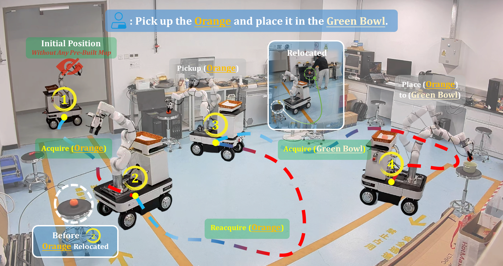
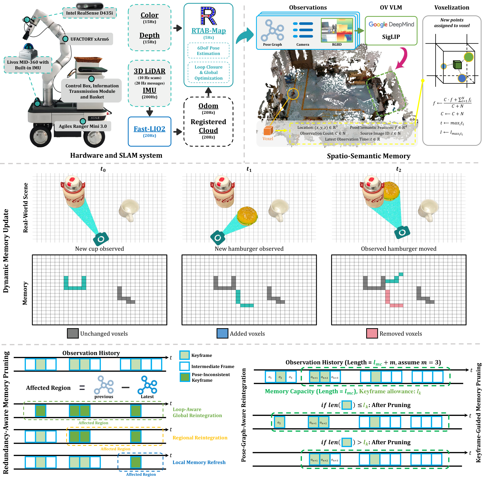

<h1 align="center">DREAM</h1>

<h3 align="center">Dynamic Resilient Spatio-Semantic Memory with Hybrid Localization for Mobile Manipulation</h3>

<p align="center">
  <strong>Mobile manipulation in a changing world — from language to exploration, memory, and action.</strong>
</p>

<p align="center">
  Zhijie Yan<sup>1</sup> · Shufei Li<sup>2</sup> · Ze Zhang<sup>1</sup> · Xin Liu<sup>1</sup> · Yuhang Zheng<sup>3</sup> · Zuoxu Wang<sup>1</sup>
  <br>
  <sup>1</sup>Beihang University &nbsp; <sup>2</sup>City University of Hong Kong &nbsp; <sup>3</sup>National University of Singapore
</p>

<p align="center">
  <a href="https://bjhyzj.github.io/dream-web/"><strong>Project Page</strong></a> ·
  <a href="https://arxiv.org/abs/2606.00576"><strong>Paper</strong></a> ·
  <a href="https://github.com/BJHYZJ/DREAM"><strong>Code</strong></a> ·
  <a href="https://bjhyzj.github.io/dream-web/#videos"><strong>Real Robot Demos</strong></a> ·
  <a href="https://bjhyzj.github.io/dream-web/simulation/"><strong>Simulation Demos</strong></a>
</p>



## Overview

Robots working in everyday indoor environments must act on a world that keeps changing. Objects move, earlier observations become outdated, and a remembered target may no longer be where the robot expects it. Reliable mobile manipulation requires the robot to keep its understanding of the scene aligned with what it can currently observe.

**DREAM** is a mobile manipulation framework for previously unseen indoor environments, operating from natural-language instructions without a pre-built map. It brings together online spatio-semantic memory, multi-sensor SLAM, hybrid target localization, task-oriented navigation, and grasping and placement in a continuous perception–action loop. The robot explores to find task-relevant objects, verifies remembered locations, updates stale information, and continues its task when the scene changes.

This repository hosts the DREAM project website, including the research overview, system figures, real-robot demonstrations, and supplementary indoor simulation gallery. The [DREAM code repository](https://github.com/BJHYZJ/DREAM) provides the implementation and setup guides.

## Method



- **Dynamic spatio-semantic memory.** Integrate RGB-D observations and visual-language features into a voxelized 3D representation, updating task-relevant information as the environment changes.
- **Redundancy-Aware Memory Pruning.** Reduce redundant stored information to support efficient memory construction and retrieval during continued operation.
- **Multi-sensor SLAM and hybrid target localization.** Use a LiDAR–inertial–visual backend for robot pose estimation, alongside memory retrieval and focused visual verification to locate and reacquire task objects.
- **Task-oriented navigation.** Explore uncertain or semantically relevant regions and select docking poses that support the next manipulation action.
- **Grasping and placement.** Connect target perception and navigation to physical pickup and delivery on a mobile manipulation platform.

Together, these components allow DREAM to build its own scene representation, revisit and verify observations, and carry information across the stages of a longer task.

## Real-Robot Experiments

DREAM is evaluated in **four dynamic indoor laboratory environments** on navigation, pickup, placement, and long-horizon mobile manipulation. The reference platform combines an **AgileX Ranger Mini V3** mobile base, **UFACTORY xArm6** arm and gripper, wrist-mounted **Intel RealSense D435i** RGB-D camera, and **Livox MID-360** LiDAR/IMU.

The paper reports the following success-rate ranges across the evaluated scenes:

| Evaluation | Reported success rate |
| --- | --- |
| Navigation | 80.0–89.2% |
| Pickup | 93.8–94.4% |
| Placement | 91.7–93.3% |
| Long-horizon tasks | 55.0–70.0% |

Across these scenes, the reported long-horizon success rate improves by **10–20 percentage points** over DynaMem, with lower spatio-semantic memory and computation costs. See the [paper](https://arxiv.org/abs/2606.00576) for metric definitions, experimental protocols, and comparisons.

### Watch the system in action

The main demonstrations combine synchronized views of the robot, localization, and semantic memory so the complete task can be followed alongside the system's internal state.

| Demonstration | What to watch |
| --- | --- |
| [Scenario 01](https://bjhyzj.github.io/dream-web/media/videos/combination_01.mp4) | A complete mobile manipulation sequence with robot, localization, and memory views. |
| [Scenario 02](https://bjhyzj.github.io/dream-web/media/videos/combination_02.mp4) | Target reacquisition and continued manipulation as the scene changes. |
| [Additional demonstrations](https://bjhyzj.github.io/dream-web/media/videos/more_videos.mp4) | Further navigation and manipulation behaviors in dynamic environments. |
| [SLAM demonstration](https://bjhyzj.github.io/dream-web/media/videos/slam_test.mp4) | The multi-sensor localization system operating in a 100 × 50 m scene. |

Visit the [real-robot gallery](https://bjhyzj.github.io/dream-web/#videos) to watch the videos and inspect the individual camera, localization, and memory streams.

## Indoor Simulation

The [simulation gallery](https://bjhyzj.github.io/dream-web/simulation/) complements the real-robot experiments with **ten selected cross-room dynamic pick-and-place demonstrations** in distinct ManiSkill indoor houses. Each task follows the robot from initial exploration through target discovery, an externally induced relocation, observation-based memory updates, rediscovery, grasping, and delivery to the instructed receptacle.

The videos present the external scene, current head-camera observation, semantic memory, and planned route at **4× playback**. Each video has a matching reproduction profile in the code repository.

The simulation adapter uses DREAM's learned semantic memory and A* navigation with simulator odometry, bounded English instruction parsing, and RGB-D geometry-based grasping and placement. These selected demonstrations illustrate the adapted task pipeline; aggregate evaluation records and implementation details are available in the [simulation documentation](https://github.com/BJHYZJ/DREAM/blob/simulation/docs/reproduction.md).

## Code and Getting Started

The implementations are maintained as two branches of [BJHYZJ/DREAM](https://github.com/BJHYZJ/DREAM):

| Implementation | Resources |
| --- | --- |
| **Real robot — `realtime`** | [Source code](https://github.com/BJHYZJ/DREAM/tree/realtime) · [Hardware and calibration](https://github.com/BJHYZJ/DREAM/blob/realtime/docs/hardware_install.md) · [Service machine setup](https://github.com/BJHYZJ/DREAM/blob/realtime/docs/service_machine_install.md) · [CAD assets](https://github.com/BJHYZJ/DREAM/tree/realtime/docs) |
| **Indoor simulation — `simulation`** | [Source code](https://github.com/BJHYZJ/DREAM/tree/simulation) · [Reproduction tutorial](https://github.com/BJHYZJ/DREAM/blob/simulation/docs/reproduction.md) · [Architecture guide](https://github.com/BJHYZJ/DREAM/blob/simulation/docs/architecture.md) |

Follow the guide for your platform to prepare the environment and run DREAM.

## Citation

If DREAM is useful for your research, please cite:

```bibtex
@misc{yan2026dynamicresilientspatiosemanticmemory,
  title={Dynamic Resilient Spatio-Semantic Memory with Hybrid Localization for Mobile Manipulation},
  author={Zhijie Yan and Shufei Li and Ze Zhang and Xin Liu and Yuhang Zheng and Zuoxu Wang},
  year={2026},
  eprint={2606.00576},
  archivePrefix={arXiv},
  primaryClass={cs.RO},
  url={https://arxiv.org/abs/2606.00576},
}
```

## Website Preview

The website is plain HTML, CSS, and JavaScript. To preview it locally, run the following from this repository and open [localhost:8000](http://localhost:8000/):

```bash
python3 -m http.server 8000 --bind 127.0.0.1
```
